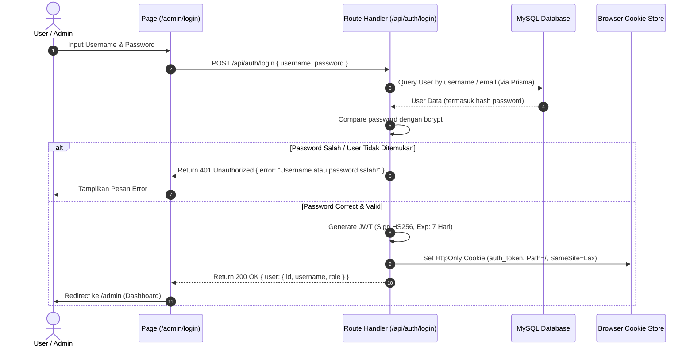
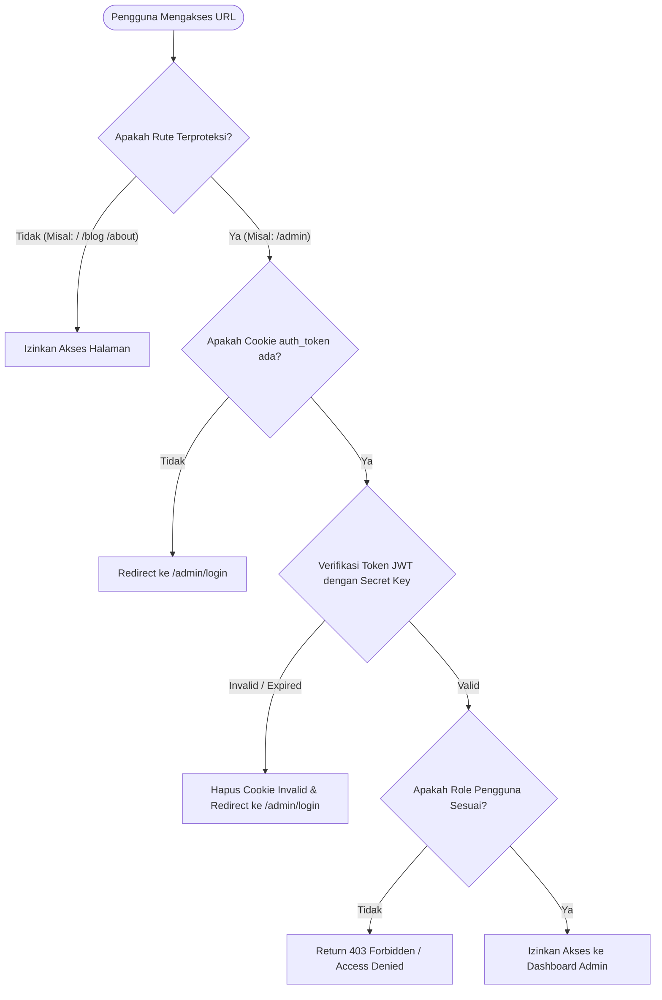

# 🔐 Dokumentasi Lengkap Sistem Autentikasi & Keamanan (Sprint 2)

Dokumen ini berisi panduan alur kerja (workflow), analisis mekanisme keamanan (security features), dan arsitektur teknis dari sistem autentikasi **Desa Wisata Lendang Belo**.

---

## 📑 Daftar Isi
1. [Ringkasan Arsitektur & Tech Stack](#-ringkasan-arsitektur--tech-stack)
2. [Alur Kerja Sistem (Workflow Diagrams)](#-alur-kerja-sistem-workflow-diagrams)
   - [A. Alur Login (Authentication Flow)](#a-alur-login-authentication-flow)
   - [B. Alur Middleware Guard (Route Protection Flow)](#b-alur-middleware-guard-route-protection-flow)
   - [C. Alur Logout (Session Termination Flow)](#c-alur-logout-session-termination-flow)
3. [Analisis Keamanan & Proteksi (Security Features)](#-analisis-keamanan--proteksi-security-features)
4. [Tabel Role & Otorisasi Hak Akses (RBAC)](#-tabel-role--otorisasi-hak-akses-rbac)
5. [Spesifikasi API Endpoint & File Structure](#-spesifikasi-api-endpoint--file-structure)

---

## 🚀 Ringkasan Arsitektur & Tech Stack

- **Framework**: Next.js (App Router v16+), React 19, TypeScript.
- **Database & ORM**: MySQL (`lendangbelo_db`) via **Prisma ORM v7**.
- **Password Hashing**: `bcryptjs` dengan **salt rounds = 10** (Password tidak pernah disimpan dalam plaintext).
- **Authorization Token**: **JWT (JSON Web Token)** via library `jose` (Masa berlaku 7 hari, memuat `id`, `username`, `role`).
- **Session Transport**: **HttpOnly Cookie** (`auth_token`), diset dengan `SameSite=Lax`, `Path=/`, dan `Secure` (di mode production).

---

## 🔄 Alur Kerja Sistem (Workflow Diagrams)

### A. Alur Login (Authentication Flow)



---

### B. Alur Middleware Guard (Route Protection Flow)

Setiap kali pengguna mengakses rute terproteksi (seperti `/admin`, `/dashboard`, `/blog/create`, `/blog/edit`), Next.js Middleware akan berjalan di level server:



---

### C. Alur Logout (Session Termination Flow)

```mermaid
sequenceDiagram
    autonumber
    actor Admin as Admin User
    participant UI as Admin Dashboard
    participant Hook as useAuth() Hook
    participant API as API (/api/auth/logout)
    participant Browser as Browser Cookie

    Admin->>UI: Klik Tombol "Keluar (Logout)"
    UI->>Hook: Memanggil fungsi logout()
    Hook->>API: POST /api/auth/logout
    API->>Browser: Response Set-Cookie: auth_token=; Path=/; Max-Age=0; Expires=1970
    Hook->>Browser: Bersihkan LocalStorage & Cookie Legacy
    Hook->>UI: Hard Redirect (window.location.href = "/admin/login")
    UI-->>Admin: Halaman Login (Sesi Terhapus Sepenuhnya)
```

---

## 🛡️ Analisis Keamanan & Proteksi (Security Features)

| Ancaman Keamanan | Mekanisme Proteksi yang Diterapkan | Penjelasan Teknis |
| :--- | :--- | :--- |
| **XSS (Cross-Site Scripting)** | **HttpOnly Cookie** | JWT Token tidak disimpan di `localStorage` melainkan di `HttpOnly Cookie`. JavaScript client-side tidak dapat membaca token ini, sehingga terhindar dari pencurian token via skrip jahat. |
| **CSRF (Cross-Site Request Forgery)** | **SameSite=Lax & Secure Attribute** | Cookie diset dengan `SameSite=Lax` untuk mencegah pengiriman cookie otomatis dari situs pihak ketiga. Pada mode production, flag `Secure` memastikan cookie hanya dikirim melalui koneksi HTTPS. |
| **Pencurian Password (Data Leak)** | **Bcrypt Password Hashing (Salt 10)** | Password di-hash menggunakan `bcryptjs` dengan salt round 10 sebelum disimpan ke MySQL. Tidak ada plain-text password yang disimpan di database. |
| **SQL Injection** | **Prisma Parameterized Queries** | Seluruh query database mengeksekusi *prepared statements* bawaan Prisma ORM, memproteksi database dari manipulasi query SQL ilegal. |
| **Unauthorized API Access** | **JWT Server-side Verification** | Setiap API endpoint sensitif (`POST /api/posts`, `DELETE /api/posts/[slug]`, `POST /api/upload`) memvalidasi JWT dari cookie secara independen. |
| **Session Hijacking / Spoofing** | **Signed JWT Signature (HS256)** | Token ditandatangani menggunakan `JWT_SECRET` yang aman. Token yang dimanipulasi akan langsung ditolak oleh `jose` verifier. |

---

## 👥 Tabel Role & Otorisasi Hak Akses (RBAC)

Sistem menggunakan kontrol akses berbasis peran (Role-Based Access Control):

| Fitur / Halaman | Public (Tamu) | Role `editor` | Role `admin` |
| :--- | :---: | :---: | :---: |
| Lihat Berita & Destinasi Desa | ✅ Ya | ✅ Ya | ✅ Ya |
| Akses Halaman Login Admin (`/admin/login`) | ✅ Ya | ✅ Ya | ✅ Ya |
| Akses Dashboard Admin (`/admin`) | ❌ Tidak | ✅ Ya | ✅ Ya |
| Buat & Edit Artikel Blog (`/blog/create`, `/blog/edit`) | ❌ Tidak | ✅ Ya | ✅ Ya |
| Upload Foto Berita (`POST /api/upload`) | ❌ Tidak | ✅ Ya | ✅ Ya |
| Hapus Artikel Blog (`DELETE /api/posts/[slug]`) | ❌ Tidak | ✅ Ya | ✅ Ya |
| Manajemen User & Hak Akses | ❌ Tidak | ❌ Tidak | ✅ Ya |

---

## 📁 Spesifikasi API Endpoint & File Structure

### File Struktur Utama
- [`lib/bcrypt.ts`](file:///d:/lendangbelo-app/lendang-belo/lib/bcrypt.ts): Fungsi pembantu hashing & verifikasi password.
- [`lib/jwt.ts`](file:///d:/lendangbelo-app/lendang-belo/lib/jwt.ts): Pembuat & pemverifikasi token JWT 7 hari.
- [`lib/auth.ts`](file:///d:/lendangbelo-app/lendang-belo/lib/auth.ts): Pengelola cookie `HttpOnly` (`setAuthCookie`, `removeAuthCookie`, `getAuthUser`).
- [`middleware.ts`](file:///d:/lendangbelo-app/lendang-belo/middleware.ts): Gatekeeper otomatis rute terproteksi di Next.js.
- [`hooks/useAuth.ts`](file:///d:/lendangbelo-app/lendang-belo/hooks/useAuth.ts): React Client Hook untuk manajemen state user login, fungsi `login()`, dan `logout()`.

### Summary API Endpoint
- **`POST /api/auth/login`**: Memvalidasi kredensial, membuat JWT, dan memasang cookie `HttpOnly`.
- **`POST /api/auth/logout`**: Menghapus cookie `auth_token` dengan `Path=/` & `MaxAge=0`.
- **`GET /api/auth/me`**: Mengembalikan profil user yang sedang aktif berdasarkan token cookie.
- **`POST /api/auth/register`**: Endpoint pendaftaran user baru (untuk mode dev/admin).
